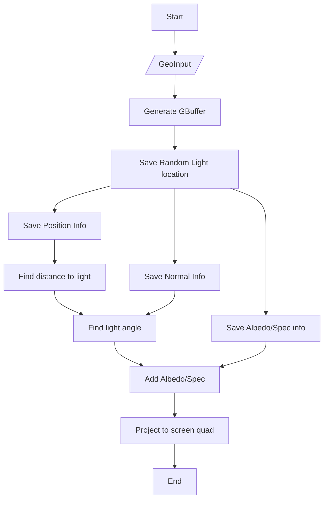
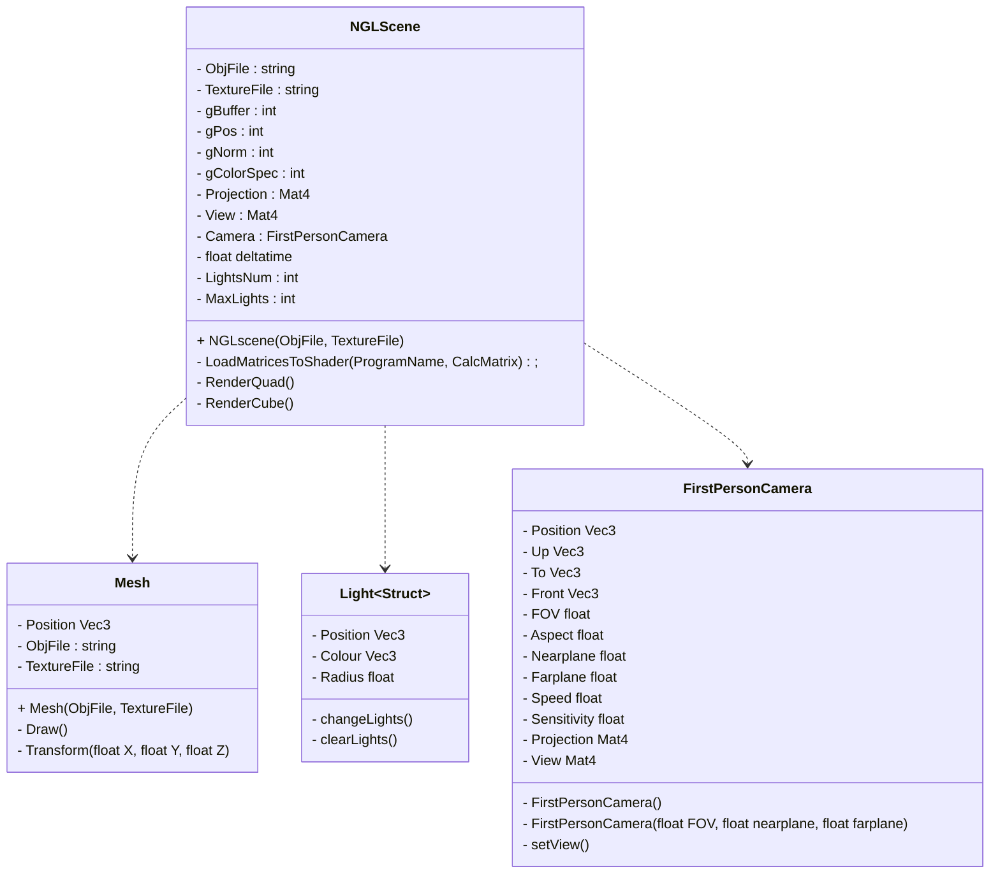

# Programming project
*Harry Ben Brass Tombs*

# Deffered Shading

Deffered shading is a technique of shading for real time usage invovling use of a Geometry buffer for information storage used later in the lighting pass, allowing for calculations of a large number of dynamic lights quickly. This project was written in C++ with the OpenGL NGL and QT libraries, to Run add new cmake target for the copy shaders to the main program 

This build is a more basic version of a modern day approach to the deffered shading pipeline, where larger game engines and rendering systems carry capabilties of dynamic loading, unloading and calculation of data throughout the experience I used a much more stripped down version. This project can be developed further to include more modern techniques of illumination, including light field probes or virtual point lights.

it's design is an adaptation of Joey De Vris' documentation of the deffered shading process included on learnopengl.com (de Vries, 2020) using the framework of the NGL libraries blankNGL scene, with inclusions of my own research into SSBOs (Stephano, n.d.) and 3D camera and object creation.

Example:

*Controls*

**W** Forward **A** Left **S** Down **D** Right

**Up** **Down** **Left** **Right** Move model position

**LeftMouse** Rotate Camera view

**O** Move lights outwards      

**I** Move lights inwards 

**M** Increase light count 

**N** Decrease light count

**L** Randomise Light positions

## *Breakdown*

## Sources

C. Lambru, Morar, A., F. Moldoveanu, V. Asavei and A. Moldoveanu (2021). *Comparative Analysis of RealTime Global Illumination Techniques in Current Game Engines.* IEEE Access, 9, pp.125158–125183. doi:https://doi.org/10.1109/ACCESS.2021.3109663.

Courrèges, A. (2015). *GTA V - Graphics Study.* [online] Adrian Courrèges. Available at: https://www.adriancourreges.com/blog/2015/11/02/gta-v-graphics-study/.

de Vries, J. (2020). *LearnOpenGL - Deferred Shading.* [online] Learnopengl.com. Available at: https://learnopengl.com/Advanced-Lighting/Deferred-Shading.

Hachisuka, T. (2025). *GPU Gems 2 Chapter 38. High-Quality Global Illumination Rendering Using Rasterization.* [online] NVIDIA Developer. Available at: https://developer.nvidia.com/gpugems/gpugems2/part-v-image-oriented-computing/chapter-38-high-quality-global-illumination.

Harris, M. and Hargreaves, S. (2004). *Deferred Shading.* [online] Available at: https://download.nvidia.com/developer/presentations/2004/6800_Leagues/6800_Leagues_Deferred_Shading.pdf.

Kantor, J. (2015). *Global Illumination through Virtual Point Lights.* [online] Available at: https://is.muni.cz/th/payge/report.pdf.

Keller, A. (n.d.). *Instant Radiosity.* [online] Available at: http://luthuli.cs.uiuc.edu/~daf/courses/Rendering/Papers-2/keller97instant.pdf#page=6&zoom=100.

Majercik, Z., Müller, T., Keller, A., Nowrouzezahrai, D. and McGuire, M. (2021). *Dynamic Diffuse Global Illumination Resampling.* Computer Graphics Forum, 41(1), pp.158–171. doi:https://doi.org/10.1111/cgf.14427.

Mcguire, M. (2017).*Irradiance & Light Field Probes with Visibility.* [online] Available at: https://casual-effects.com/research/McGuire2017LightField/McGuire2017LightField-GDCSlides.pdf.

McGuire, M., Mara, M., Nowrouzezahrai, D. and Luebke, D. (2017). *Real-time Global Illumination Using Precomputed Light Field Probes. Proceedings of the 21st ACM SIGGRAPH Symposium on Interactive 3D Graphics and Games.* doi:https://doi.org/10.1145/3023368.3023378.

Möller, T., Haines, E., Naty Hoffman, Pesce, A., Iwanicki, M. and Sébastien Hillaire (2018). *Real-time Rendering.* Boca Raton: Crc Press, Taylor & Francis Group.

Pesce, A. (2020). *Hallucinations re: the rendering of Cyberpunk 2077.* [online] Blogspot.com. Available at: https://c0de517e.blogspot.com/2020/12/hallucinations-re-rendering-of.html.

Santell, J. (2019). *Model View Projection.* [online] jsantell.com. Available at: https://jsantell.com/model-view-projection/.

Shishkovtsov, O. (2005). *GPU Gems 2 Chapter 9. Deferred Shading in S.T.A.L.K.E.R.* [online] NVIDIA Developer. Available at: https://developer.nvidia.com/gpugems/gpugems2/part-ii-shading-lighting-and-shadows/chapter-9-deferred-shading-stalker.

Speierer, S. (n.d.). *Metropolis Virtual Point Light Rendering.* [online] Available at: https://speierers.github.io/resources/pdf/metropolis_vpl.pdf

Stephano, J. (n.d.). *Shader Storage Buffer Objects (SSBOs).* [online] J Stephano. Available at: https://ktstephano.github.io/rendering/opengl/ssbos.

Stephano, J. (2020). *StratusGFX Technical Frame Analysis.* [online] J Stephano. Available at: https://ktstephano.github.io/rendering/stratusgfx/frame_analysis_v0_10#realtime-global-illumination.

Victor Gordan (2021). OpenGL Tutorial 8 - Camera. [online] YouTube. Available at: https://www.youtube.com/watch?v=86_pQCKOIPk.

