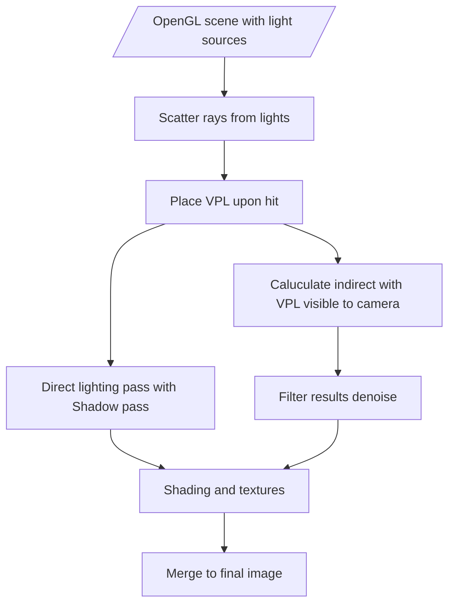

# Programming project
*Harry Ben Brass Tombs*

## Realtime Global illumination
This **is** the project i've decided on

The one suggested in the sample projects. This is me not trying to reinvent the wheel here. I get lighting systems and i know how they work already ,well enough to know (vaugely) how to approach this project, so doing a path tracer or something along those lines would interested me greatly. **I THINK IT WILL STILL BE VERY HARD** but i think its a more possible goal to achieve. 

A lot of papers i've found and talks i've listened to are from nvidia with pretty useful complete github pages of their RTXGI (global illumination) and RTXDI (dynamic illumination) SDKs. Which i will obviously be a great help for me to look at more direct uses of C++ implementation
So there's no real way for me to come up with a revolutionary idea, but i guess thats not the point

I've learned im doing rasterisation first to figure things out because its the most common implementation of realtime GI 
It involves computing an objects normals and using pre baked light maps to display realtime GI
we can combine rasterisation with a quicker form or ray tracing to get a pretty nice looking real time GI solution

i also looked into light field probes which is similar but not the same thing
light field probes work by having light "sensors" place across the scene which bake the lighting information and apply it to nearby objects based on proximity
They are exceptionally fast to run but don't provide the most accurate lighting setup, as poor placement can lead to light or shadows leaking into incorrect places

## SO I GOT SOME THINGS WRONG

So since i've never touched openGL before I didn't know what i could do with it so i thought i had to develop the rendering systems myself like rasterising BUT since we learned it in class just recently i've discovered i was incredibly wrong, SO we're back on track with global illumination, i'll work on it to catch up SORRY!!

I've gotten rid of all the stuff i did before since it was just confusing me

### Instant radiosity

This is what i should've been looking into this whole time

Its based on these papers:

https://www.cg.tuwien.ac.at/research/publications/2008/radax-2008-ir/radax-2008-ir-paper.pdf
https://speierers.github.io/resources/pdf/metropolis_vpl.pdf

which themselves are based on this paper but i found it too confusing:

http://luthuli.cs.uiuc.edu/~daf/courses/Rendering/Papers-2/keller97instant.pdf

This project was also huge help:

https://ktstephano.github.io/rendering/stratusgfx/frame_analysis_v0_10#realtime-global-illumination

The technique involves creating indirect lighitng from reading info from virtual point lights. Virtual point lights are an invisible point light placed around the scene taking in the lighting information surrounding it. Then applys radiance information to an object combined with the direct PBR lighting and the objects textures.

You use a path tracer steming from each light source to scatter VPLs and use its distance from a light source and amount of bounces to reach to determin its contribution to the indirect lighting. This means you have light sources scattered in areas not accessable by the main light source. I've heard computer shaders work well for lightweight path tracing so i'll try that probably.

**FLOWCHART**

## Sources

I will cite these correctly later please excuse my poor referincing system for now

https://en.wikipedia.org/wiki/Ray_tracing_(graphics)

https://jcgt.org/published/0008/02/01/

https://www.sci.utah.edu/~wald/PhD/wald_phd.pdf

https://github.com/NVIDIAGameWorks/RTXGI

https://developer.nvidia.com/rtx/ray-tracing/rtxgi

https://github.com/NVIDIAGameWorks/RTXDI

https://resources.nvidia.com/en-us-game-dev-rtx/gtcspring21-s32639

https://alain.xyz/blog/ray-tracing-denoising

https://bth.diva-portal.org/smash/get/diva2:1440210/FULLTEXT02.pdf

https://developer.download.nvidia.com/video/gputechconf/gtc/2019/presentation/s9985-exploring-ray-traced-future-in-metro-exodus.pdf

https://cs.dartmouth.edu/~wjarosz/publications/mara17towards.html

https://gdcvault.com/play/1026722/RTXGI-Scalable-Ray-Traced-Global

https://gdcvault.com/play/1026721/RTX-Ray-Tracing-Best-Practices

https://www.gdcvault.com/play/1024353/

https://in1weekend.blogspot.com/2016/01/ray-tracing-in-one-weekend.html

https://ktstephano.github.io/rendering/stratusgfx/frame_analysis_v0_10#realtime-global-illumination

https://docs.unity3d.com/Manual/LightProbes.html

https://casual-effects.com/research/McGuire2017LightField/index.html

https://casual-effects.com/research/McGuire2017LightField/McGuire2017LightField-GDCSlides.pdf

https://dl.acm.org/doi/abs/10.1145/3023368.3023378

https://github.com/Global-Illuminati/Precomputed-Light-Field-Probes

https://developer.nvidia.com/gpugems/gpugems2/part-v-image-oriented-computing/chapter-38-high-quality-global-illumination

https://bpb-us-w2.wpmucdn.com/sites.gatech.edu/dist/e/466/files/2014/07/gpulecture05su14_lightrast.pdf

https://voltaico.net/files/article.pdf

https://www.scratchapixel.com/lessons/3d-basic-rendering/rasterization-practical-implementation/overview-rasterization-algorithm.html

https://en.wikipedia.org/wiki/Rasterisation

https://blogs.nvidia.com/blog/whats-difference-between-ray-tracing-rasterization/

http://luthuli.cs.uiuc.edu/~daf/courses/Rendering/Papers-2/keller97instant.pdf#page=6&zoom=100,72,920

https://www.diva-portal.org/smash/get/diva2:482587/FULLTEXT01.pdf

https://www.csie.ntu.edu.tw/~cyy/courses/rendering/13fall/lectures/handouts/ManyLight-I.pdf

https://is.muni.cz/th/payge/report.pdf

https://github.com/rohith10/ForwardPlus-InstantRadiosity/blob/master/Documentation.pdf

https://speierers.github.io/resources/pdf/metropolis_vpl.pdf

### Other

https://ieeexplore.ieee.org/abstract/document/9527241

https://learnopengl.com/

https://graphicscodex.com/app/app.html

https://www.khronos.org/opengl/wiki/

https://en.wikipedia.org/wiki/Bidirectional_reflectance_distribution_function

https://en.wikipedia.org/wiki/Rendering_equation

https://www.youtube.com/watch?v=gsZiJeaMO48

https://ebookcentral.proquest.com/lib/bournemouth-ebooks/reader.action?docID=5754532&ppg=124#ppg=458

