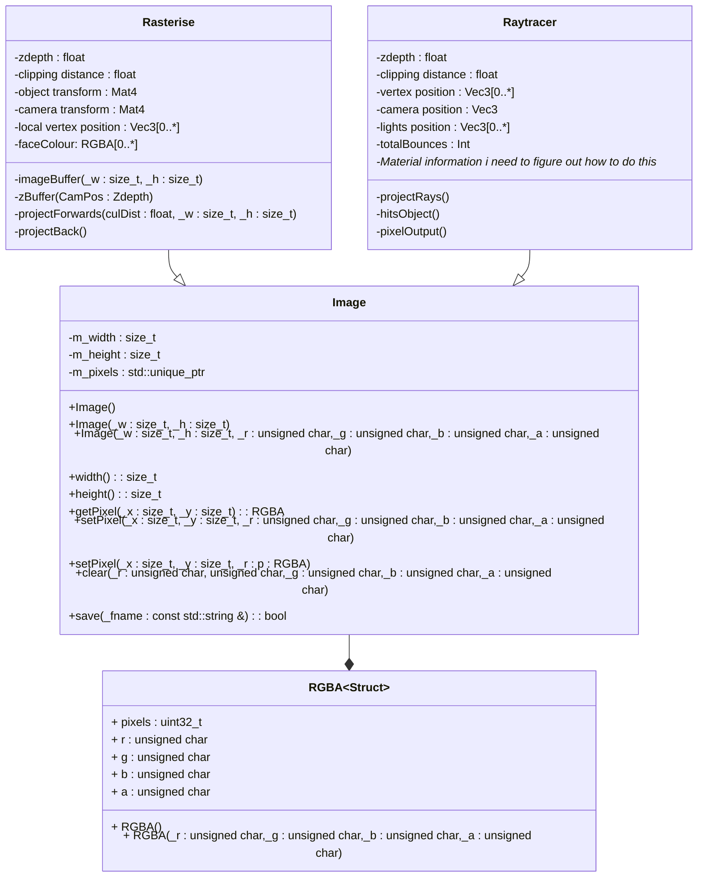
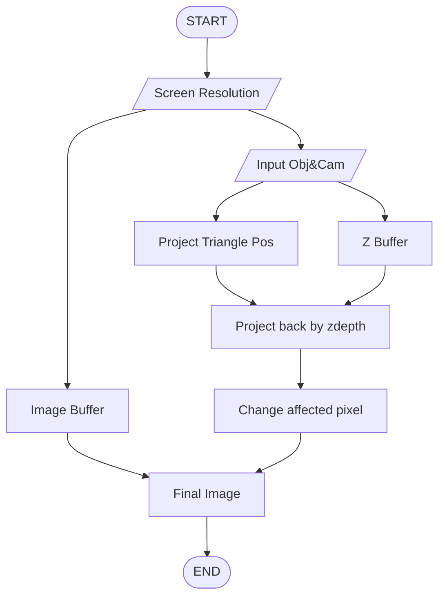
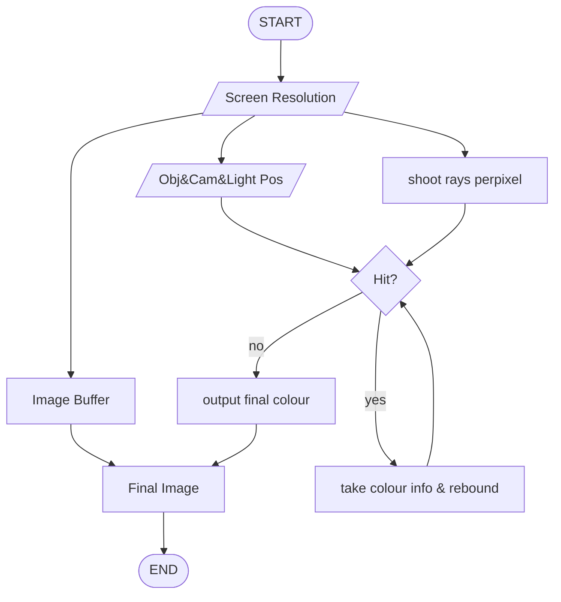

# Programming project
*Harry Ben Brass Tombs*

## Realtime Global illumination
This is the project i've decided on

The one suggested in the sample projects. This is me not trying to reinvent the wheel here. I get lighting systems and i know how they work already ,well enough to know (vaugely) how to approach this project, so doing a path tracer or something along those lines would interested me greatly. **I THINK IT WILL STILL BE VERY HARD** but i think its a more possible goal to achieve. 

A lot of papers i've found and talks i've listened to are from nvidia with pretty useful complete github pages of their RTXGI (global illumination) and RTXDI (dynamic illumination) SDKs. Which i will obviously be a great help for me to look at more direct uses of C++ implementation
So there's no real way for me to come up with a revolutionary idea, but i guess thats not the point

I've learned im doing rasterisation first to figure things out because its the most common implementation of realtime GI 
It involves computing an objects normals and using pre baked light maps to display realtime GI
we can combine rasterisation with a quicker form or ray tracing to get a pretty nice looking real time GI solution

i also looked into light field probes which is similar but not the same thing
light field probes work by having light "sensors" place across the scene which bake the lighting information and apply it to nearby objects based on proximity
They are exceptionally fast to run but don't provide the most accurate lighting setup, as poor placement can lead to light or shadows leaking into incorrect places

## Razterisation

Rasterisation is rendering images by directly projecting objects onto the pixels themselves, measuring the frame size and splating whats captured into the pixel it matches up to, to create the correct shape in the rendered image.

When first rendering an image buffer is created and the frame size is shot out into space and sees what objects it hits, technically infinite distance but usually stopped at a point. The depth in the cameras Z axis is captured in order to process z depth because we humans process z depth (we have two eyes).
After that each vertex of each triangle of each object is projected forwards towards the camera, scaling to the calculated z depth size and the affected pixels are coloured in to create a 2D image
## Ray Tracing

Real life light works by light coming from a source and bouncing into your eye, a room can be lit without you being there to see it since real life doesn't require processing power
Ray tracing works in the opposite way, A camera functioning as an eye shoots rays into a space and bounces off an object a specified number of times or until it finds a light source
The colour of that pixel is calculated by the informaiton gathered by those bounces including nearby light sources, reflective objects or lack there of.

In a 3D lit scene with a camera you take the resolution of the screen and for each pixel detailed in the camera shoot a ray throught the centre of the pixel. if it hits an object (otherwise render nothing) find object normal and material information and bounce off at X angle (depending on surfaces and normals) for Y number of bounces (defined in the render settings) or until it returns to a light source. Based on the information gathered from the secondary bounces (light reflected from nearby object or dedicated light sources or nothing) create an output colour corresponding to the pixel.

I WILL (HOPEFULLY) USE BOTH OF THESE TECHNIQUES FOR A PRETTY REAL TIME GI MACHINE 

## Breakdown

### Class Diagram

I'm going to be using the RGBA and Image classes we already made in class as well as my own class diagrams 

Source is you Jon thanks &#128077;

### Flowcharts

Rasterisation

Raytracing

*Please let me know if im missing something*

## Sources

I will cite these correctly later please excuse my poor referincing system for now

### Ray tracing 
https://en.wikipedia.org/wiki/Ray_tracing_(graphics)

https://jcgt.org/published/0008/02/01/

https://www.sci.utah.edu/~wald/PhD/wald_phd.pdf

https://github.com/NVIDIAGameWorks/RTXGI

https://developer.nvidia.com/rtx/ray-tracing/rtxgi

https://github.com/NVIDIAGameWorks/RTXDI

https://resources.nvidia.com/en-us-game-dev-rtx/gtcspring21-s32639

https://alain.xyz/blog/ray-tracing-denoising

https://bth.diva-portal.org/smash/get/diva2:1440210/FULLTEXT02.pdf

https://developer.download.nvidia.com/video/gputechconf/gtc/2019/presentation/s9985-exploring-ray-traced-future-in-metro-exodus.pdf

https://cs.dartmouth.edu/~wjarosz/publications/mara17towards.html

https://gdcvault.com/play/1026722/RTXGI-Scalable-Ray-Traced-Global

https://gdcvault.com/play/1026721/RTX-Ray-Tracing-Best-Practices

https://www.gdcvault.com/play/1024353/

https://in1weekend.blogspot.com/2016/01/ray-tracing-in-one-weekend.html

### Rasterisation ish

https://docs.unity3d.com/Manual/LightProbes.html

https://casual-effects.com/research/McGuire2017LightField/index.html

https://casual-effects.com/research/McGuire2017LightField/McGuire2017LightField-GDCSlides.pdf

https://dl.acm.org/doi/abs/10.1145/3023368.3023378

https://github.com/Global-Illuminati/Precomputed-Light-Field-Probes

https://developer.nvidia.com/gpugems/gpugems2/part-v-image-oriented-computing/chapter-38-high-quality-global-illumination

https://bpb-us-w2.wpmucdn.com/sites.gatech.edu/dist/e/466/files/2014/07/gpulecture05su14_lightrast.pdf

https://voltaico.net/files/article.pdf

https://www.scratchapixel.com/lessons/3d-basic-rendering/rasterization-practical-implementation/overview-rasterization-algorithm.html

https://en.wikipedia.org/wiki/Rasterisation

https://blogs.nvidia.com/blog/whats-difference-between-ray-tracing-rasterization/

### Other

https://ieeexplore.ieee.org/abstract/document/9527241

https://learnopengl.com/

https://graphicscodex.com/app/app.html

https://www.khronos.org/opengl/wiki/

https://en.wikipedia.org/wiki/Bidirectional_reflectance_distribution_function

https://en.wikipedia.org/wiki/Rendering_equation

https://www.youtube.com/watch?v=gsZiJeaMO48

https://ebookcentral.proquest.com/lib/bournemouth-ebooks/reader.action?docID=5754532&ppg=124#ppg=458

